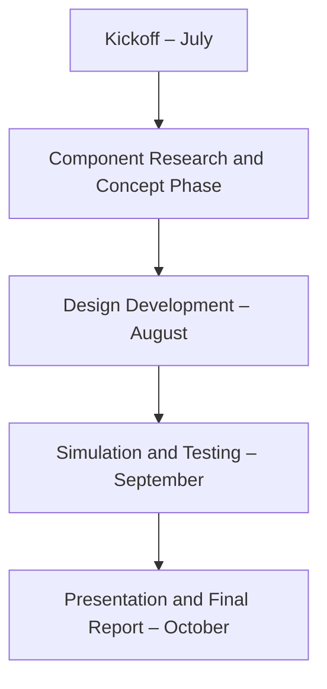

# Optimus Syria – Weekly Progress Dashboard

This is the public dashboard for the Optimus Syria – Wind Energy Converter Project,  
a joint initiative between Hochschule Flensburg, Hochschule Kiel, and Damascus University.

---

## Reporting Period: Week 1 (21–26 July 2025)

| No. | Team Name                    | Team Leader                        | Status / Summary                                                   |
|-----|------------------------------|-------------------------------------|---------------------------------------------------------------------|
| 01  | Load and Dynamics            | Mohamed Reda Alywa                 | Installed OpenFAST, studied control strategies and LIDAR           |
| 02  | Feedback Controller          | Mirza Dincer                       | Completed Simulink Onramp, began academic research                 |
| 03  | Lidar Assisted Control       | Hesham Mahmoud                     | Awaiting kickoff meeting with Prof. Schlipf                        |
| 04  | Rotor Blade Aerodynamic      | Jay Atulbhai Pandya                | Started learning Q-Blade, studying research papers                 |
| 05  | Rotor Blade Structures       | Bhima Babu Masare                  | Assigned roles, requested site data, team meeting held             |
| 06  | Electrical Drivetrain        | Aiswarya Vijayan                   | Researched regional electrical markets and generator types         |
| 07  | Grid Code Development        | Marcus Attalla                     | Completed documentation, initiated simulation setup                |
| 08  | Rotor Hub and Pitch System   | Dhruvin Bhupatbhai Kakdiya         | Setup software, requested contact with last year's team            |
| 09  | Rotor Bearing System         | Divyesh Satishkumar Mistry         | Concept freeze in progress, selected bearing types                 |
| 10  | Gearbox, Brake, Coupling     | Nehang Jitendra Joshi              | Research on drivetrain, brake systems, and market suppliers        |
| 11  | Machine Bed & Yaw System     | Sathishkumar Venkatachalam         | Studied casting methods, contacted industry professionals          |
| 12  | Tower                        | Ibrahim Mostafa                    | Market research and location-related questions submitted           |
| 13  | Foundation                   | Jehad Albaali                      | No report submitted                                                |
| 14  | Storage System               | Farshid Montakhab                  | No report submitted                                                |
| 15  | Wind Farm Development        | Luis Urhahn                        | No report submitted                                                |

---

## Project Timeline

---

## Weekly Report Guidelines

- Reports must be submitted every Saturday.
- Each team must upload a markdown or PDF file in their assigned GitHub folder:
  Example: `Team-01_Load-and-Dynamics/Week-1.md`

---

Last updated by: Bakhtyar Karimzade, Project Manager
