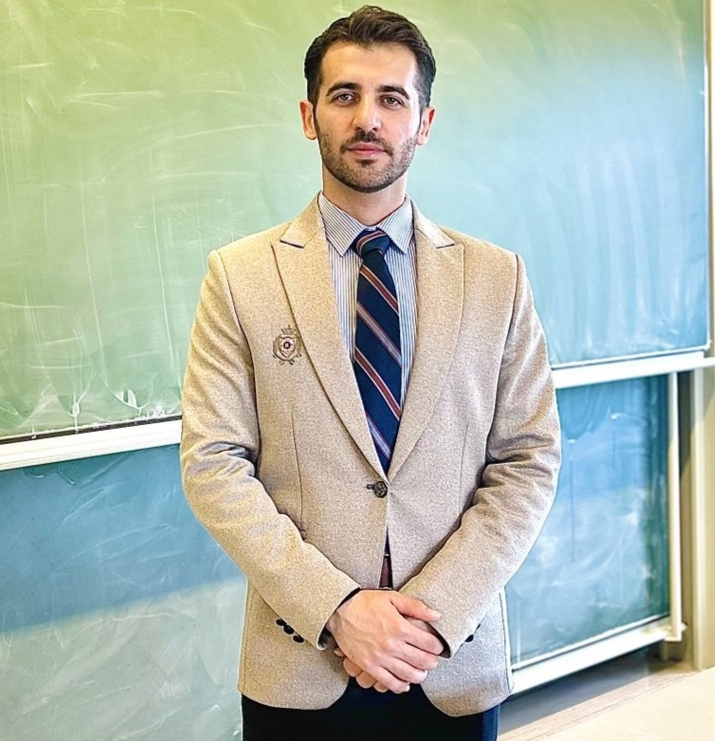

  <a href="index.html" style="color:white; margin:0 15px; font-weight:bold; text-decoration:none;">Home</a>
  <a href="week1.html" style="color:white; margin:0 15px; font-weight:bold; text-decoration:none;">Reports</a>
  <a href="team.html" style="color:white; margin:0 15px; font-weight:bold; text-decoration:none;">Team</a>
  <a href="about.html" style="color:white; margin:0 15px; font-weight:bold; text-decoration:none;">About</a>
  <a href="contact.html" style="color:white; margin:0 15px; font-weight:bold; text-decoration:none;">Contact</a>

 

<link rel="stylesheet" href="assets/style.css">

<h2>Contact</h2>

  
  
Bakhtyar Karimzade Head of Project – Optimus Syria

  Email: <a href="mailto:bakhtyar.karimzada@gmail.com">bakhtyar-sabir.karim@stud.hs-flensburg.de</a> 

For any technical inquiries or collaboration ideas, feel free to reach out.  
You may also contact our coordinating institutions:

- Hochschule Kiel
- Hochschule Flensburg  
- Damascus University
  
[Back to Main Page](index.md)

