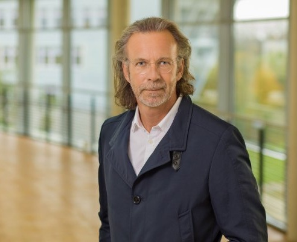
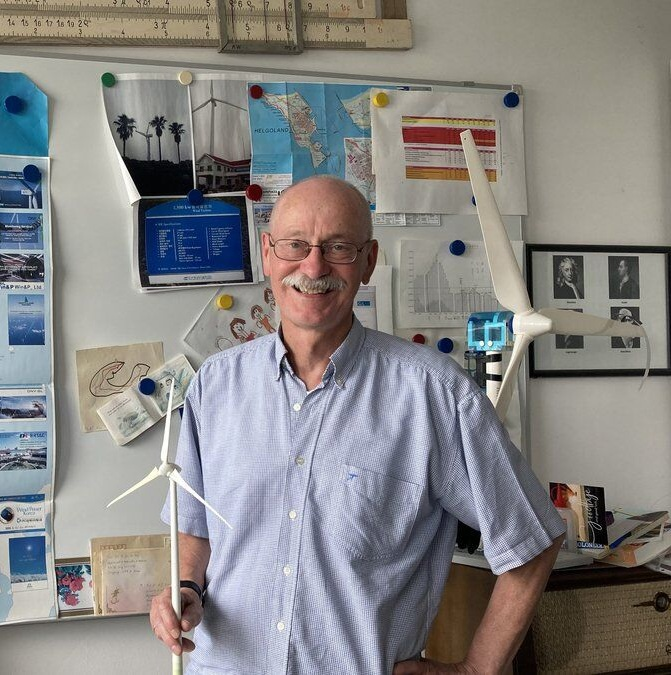
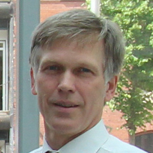
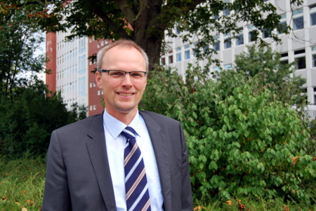
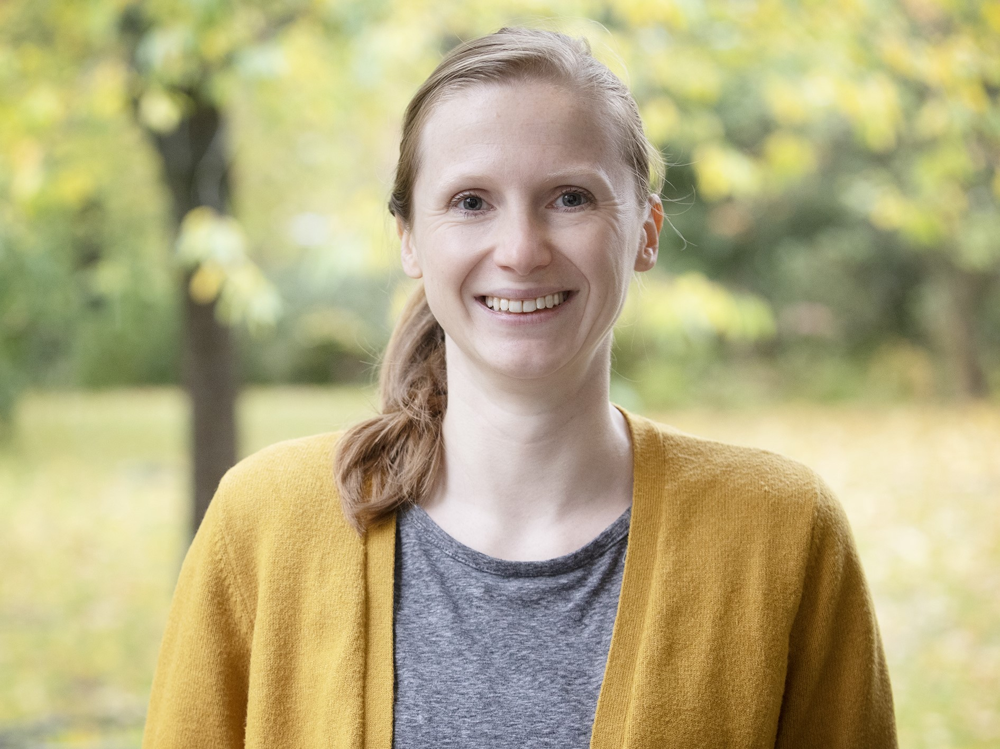

<link rel="stylesheet" href="assets/style.css">

<!-- Top Navigation -->

  <a href="index.html" style="color:white; margin:0 15px; font-weight:bold; text-decoration:none;">Home</a>
  <a href="week1.html" style="color:white; margin:0 15px; font-weight:bold; text-decoration:none;">Reports</a>
  <a href="team.html" style="color:white; margin:0 15px; font-weight:bold; text-decoration:none;">Team</a>
  <a href="about.html" style="color:white; margin:0 15px; font-weight:bold; text-decoration:none;">About</a>
  <a href="contact.html" style="color:white; margin:0 15px; font-weight:bold; text-decoration:none;">Contact</a>

 
<h2>Supervising Professors – Optimus Syria (WS 2025/26)</h2>

The Optimus Syria project is guided by a team of distinguished professors and researchers from Hochschule Kiel & Flensburg, and the University of Damascus. Their technical expertise and mentoring play a critical role in supporting student teams through design, modeling, simulation, and system integration of the wind energy converter. Each professor provides domain-specific supervision to ensure scientific rigor, engineering quality, and real-world applicability of the results.

  
  

    
    <h2 style="color: #28a745; margin-top: 15px;">Prof. Dr.-Ing. Torsten Faber</h2>
  

  

    

      <strong>Supervisor for:</strong> 
      – Tower 
      – Foundation
    

    
    

      Prof. Faber, Director of the Wind Energy Technology Institute (WETI) at Hochschule Flensburg, supervised the Tower &amp; Foundation team. He guided them through structural concept development, design, and dimensioning, ensuring stability, reliability, and alignment with project requirements. His leadership in wind energy engineering has been instrumental in the team’s success.
    

  

  

  
  

    
    <h2 style="color: #28a745; margin-top: 15px;">Prof. Dr.-Ing. David Schlipf</h2>
  

  

    

      <strong>Supervisor for:</strong> 
      – Feedback Controller 
      – Lidar Assisted Control
    

    
    

      Prof. Schlipf is a leading expert in wind turbine control systems, including both feedback and feedforward control strategies. He mentors students in ROSCO integration, controller design, and Lidar-assisted predictive systems.
    

  

  
  

    
    <h2 style="color: #28a745; margin-top: 15px;">Prof. Dr.-Ing. A.P. Schaffarczyk</h2>
  

  

    

      <strong>Supervisor for:</strong> 
      – Rotor Blade Aerodynamics
    

    
    

      Prof. Schaffarczyk specializes in aerodynamic optimization, blade design, and performance analysis using QBlade. He supports the team in developing efficient rotor blade profiles tailored to Syrian wind conditions.
    

  

  
  

    
    <h2 style="color: #28a745; margin-top: 15px;">Prof. Dr. Manfred Manjock</h2>
  

  

    

      <strong>Supervisor for:</strong> 
      – Load and Dynamics
    

    
    

      Prof. Manjock guides the team in dynamic simulation, load case definition, and OpenFAST modeling to ensure reliable load certification and structural integration across all turbine components.
    

  

  
  

    
    <h2 style="color: #28a745; margin-top: 15px;">Prof. Dr. Saiju</h2>
  

  

    

      <strong>Supervisor for:</strong> 
      – Electrical Drivetrain 
      – Grid Code Development
    

    
    

      Prof. Saiju provides expertise in electrical system modeling, generator and converter design, and grid compliance. His guidance ensures the electrical architecture meets performance and regulatory requirements.
    

  

  
  

    
    <h2 style="color: #28a745; margin-top: 15px;">Dr. Laurence Alhrshy</h2>
  

  

    

      <strong>Supervisor for:</strong> 
      – Storage System 
      – Rotor Blade Structures
    

    
    

      Dr. Alhrshy supports the structural design of composite rotor blades using NuMAD and finite element principles, ensuring strength, safety, and manufacturing feasibility.
    

  

  
  

    
    <h2 style="color: #28a745; margin-top: 15px;">Prof. Dr.-Ing. Peter Quell</h2>
  

  

    

      <strong>Supervisor for:</strong> 
      – Rotor Hub and Pitch System 
      – Rotor Bearing System 
      – Gearbox, Brake, Coupling 
      – Machine Bed & Yaw System
    

    
    

      Prof. Quell oversees all mechanical and structural integration aspects, including nacelle design, drivetrain configuration, tower construction, civil foundation, and full wind farm planning. His support ensures mechanical compatibility, transport feasibility, and local infrastructure integration.
    

  

  
  

    
    <h2 style="color: #28a745; margin-top: 15px;">Dr. Marina Blohm</h2>
  

  

    

      <strong>Supervisor for:</strong> 
      – Wind Project Development
    

    
    

      Dr. Blohm, Research Associate at Europa-Universität Flensburg, supervised the Wind Farm Development team. With her background in wind project development and renewable energy research, she provided valuable guidance on planning and sustainability aspects of the project.
    

  

<h2>Project Teams</h2>

The Optimus Syria project is organized into 15 engineering teams. Each team is responsible for a key subsystem of the wind energy converter, working from concept to final design and integration.

<b>Loads and Dynamics</b> 
Team leader: Mohamed Reda Fawzy Ahmed Alywa 
Responsibility: Creates the OpenFAST simulation model, performs load case definition and calculation, and provides fatigue and extreme load data to all design teams.

<b>Feedback Controller</b> 
Team leader: Mirza Dincer 
Responsibility: Designs and tunes the dynamic feedback control system using ROSCO to regulate turbine behavior and mitigate structural loads.

<b>Lidar Assisted Control</b> 
Team leader: Hesham Mahmoud 
Responsibility: Implements LIDAR-based feedforward control strategies to anticipate wind changes and enhance pitch control responsiveness.

<b>Rotor Blade Aerodynamics</b> 
Team leader: Jay Atulbhai Pandya 
Responsibility: Designs the aerodynamic blade shape using QBlade, aiming for high efficiency, low noise, and balanced loading across the rotor span.

<b>Rotor Blade Structures</b> 
Team leader: Bhima Babu Masare 
Responsibility: Designs the internal composite structure of the rotor blades using NuMAD, focusing on load-bearing performance and manufacturability.

<b>Electrical Drivetrain</b> 
Team leader: Aiswarya Vijayan 
Responsibility: Develops the generator, converter, and transformer system, ensuring electrical compatibility, efficiency, and simulation under grid conditions.

<b>Grid Code Development</b> 
Team leader: Marcus Attalla 
Responsibility: Ensures the wind turbine complies with Syrian and international grid codes, including voltage, frequency, and fault handling behaviors.

<b>Rotor Hub and Pitch System</b> 
Team leader: Dhruvin Bhupatbhai Kakdiya 
Responsibility: Designs the rotor hub and pitch mechanism, including actuation, bearing selection, and integration with the drivetrain and blades.

<b>Rotor Bearing System</b> 
Team leader: Divyesh Sathishkumar Mistry 
Responsibility: Designs the main rotor bearing configuration, performs mechanical and fatigue analysis, and ensures secure load transfer to the drivetrain.

<b>Gearbox, Brake, Coupling</b> 
Team leader: Nehang Jitendra Joshi 
Responsibility: Develops the mechanical drivetrain including gearbox layout, mechanical brake system, and coupling to ensure efficient power transmission.

<b>Machine Bed & Yaw System</b> 
Team leader: Sathishkumar Venkatachalam 
Responsibility: Designs the machine bed to house the nacelle components and the yaw system that aligns the turbine with wind direction.

<b>Tower</b> 
Team leader: Ibrahim Mostafa 
Responsibility: Designs the tower structure to support the nacelle and rotor under all operational loads while considering transportation and installation constraints in Syria.

<b>Foundation</b> 
Team leader: Jehad Albaali 
Responsibility: Designs the wind turbine foundation based on local soil and climate data, ensuring structural safety and feasibility of construction.

<b>Storage System</b> 
Team leader: Farshid Montakhab 
Responsibility: Designs and integrates an energy storage system (e.g., battery) to improve grid compatibility and enable energy smoothing and support.

<b>Wind Farm Development</b> 
Team leader: Luis Urhahn 
Responsibility: Identifies the prototype site in Syria, evaluates site-specific constraints, and develops a full wind farm layout and infrastructure plan for installation.

<link rel="stylesheet" href="assets/style.css">

<a href="index.html" style="color: #3CB371; text-decoration: none; font-weight: bold;">Back to Home</a>

